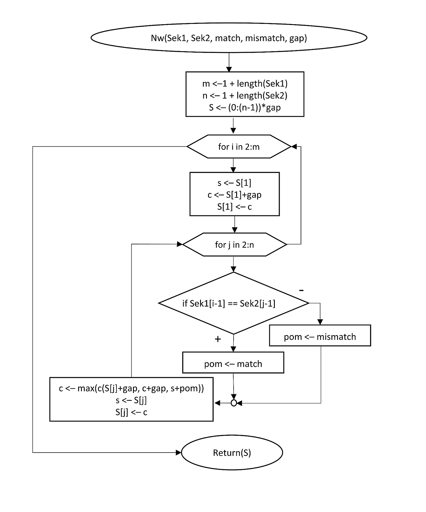

# Hirschbergův algoritmus
Algoritmus využívající dynamické programování pro nalezení optimálního globálního zarovnání dvou sekvencí znaků **X** a **Y**, kde *n* je délka sekvence **X** a *m* je délka sekvence **Y**.
Oproti Needleman-Wunsch algoritmu je Hirschbergův algoritmus prostorově efektivnější:

| | Časová náročnost | Prostorová náročnost |
|---|---|---|
| Needleman-Wunschův algoritmus | *O(n\*m)* | *O(n\*m)* |
| Hirschbergův algoritmus | *O(n\*m)* | *O(min{n,m})* |

### Popis algoritmu
Viz pdf soubor *Hirschberguv_algoritmus.pdf* nebo [wikipedie](https://en.wikipedia.org/wiki/Hirschberg%27s_algorithm).

<details>
<summary>Spoiler! Nápověda</summary>

#### Vývojový diagram Needleman-Wunschova algoritmu


#### Pseudo kód Hirschbergova algoritmu
```
function Hirschberg(X, Y)
    Z = ""
    W = ""
    if length(X) == 0
        for i=1 to length(Y)
            Z = Z + '-'
            W = W + Y(i)
        end
    else if length(Y) == 0
        for i=1 to length(X)
            Z = Z + X(i)
            W = W + '-'
        end
    else if length(X) == 1 or length(Y) == 1
        (Z,W) = NeedlemanWunsch(X, Y)
    else
        xlen = length(X)
        xmid = length(X) / 2
        ylen = length(Y)

        ScoreL = NWScore(X(1:xmid), Y)
        ScoreR = NWScore(rev(X(xmid+1:xlen)), rev(Y))
        ymid = arg max ScoreL + rev(ScoreR)

        (Z,W) = Hirschberg(X(1:xmid), Y(1:ymid)) + Hirschberg(X(xmid+1:xlen), Y(ymid+1:ylen))
    end
    return (Z, W)
```
</details>

### Stažení podkladů z GitHub
<details>
<summary>Nastavení Git</summary>

> #### Nastavení Git
> * Nastavení editoru
> ```bash
> git config --global core.editor notepad
> ```
> * Nastavení jména a emailu
> ```bash
> git config --global user.name "Zuzana Nova"
> git config --global user.email z.nova@vut.cz
> ```
> * Ověření aktuálního nastavení
> ```bash
> git config --global --list
> ```
>
</details>

* Na vlastním GitHub účtu vytvořte kopii (**fork**) zdrojového repozitáře. 
  Otevřete v prohlížeči adresu zdrojového repozitáře. Vpravo nahoře najdete tlačítko <kbd>Fork</kbd> a klikněte na něj.
  
* Naklonujte si repozitář ze svého GitHub účtu do složky s dnešním cvičením.
```bash
git clone <repository address>
```
* V lokálním repozitáři nastavte pomocí terminálu novou vzdálenou adresu (**remote**) na **původní** (vut-mpc-prg) adresu repozitáře (trojúhelníková spolupráce):
```bash
git remote add upstream https://github.com/vut-mpc-prg/cviceni_4.git
```

### Odeslání souborů na GitHub
Vytvořte novou revizi (**commit**) a změny nahrajte na svůj vzdálený repozitář (**push**).
* Nově vytvořený soubor přidejte do revize.
```bash
git add <file_name>
```
* Vytvořte revizi, zadejte zprávu k revizi, uložte a zavřete.
```bash
git commit
```
* Vytvořenou revizi odešlete do svého repozitáře na GitHub.
```bash
git push origin master
```